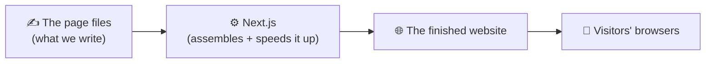
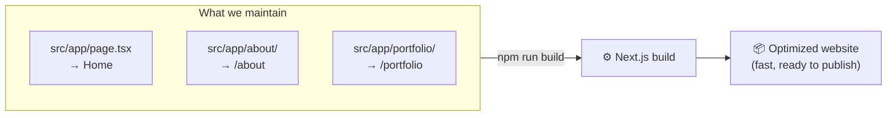
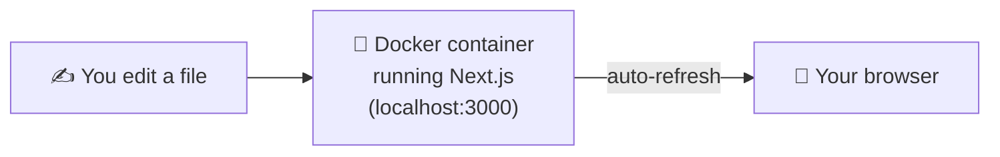
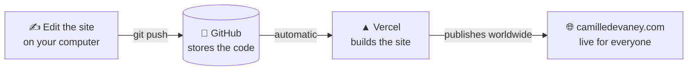

# CLAUDE.md — camilledevaney.com

> **Read me first.** This is the "operator's manual" for the website. It's written
> so a **non-technical reader can follow it** (hi Camille! 👋) *and* so a developer or
> AI assistant has the conventions they need. Nothing here requires you to be a coder.

---

## 1. What this website is

**`camilledevaney.com` is the personal website of Camille Devaney.**

It is her home on the internet — one place that holds:

- 🎨 **Her artwork** — a gallery / portfolio of pieces she wants to show the world.
- 💼 **Her professional work** — *this is the priority.* Résumé / experience, the
  services or skills she offers, ways to hire or collaborate with her, and a clear way
  to get in touch. When in doubt, the **professional side is the front door**; the
  artwork lives alongside it as part of who she is.

Think of it as her digital business card *and* her exhibition wall — with the
business card facing forward.

**Audience:** people who want to learn about Camille professionally (potential
employers, clients, collaborators) and people who want to enjoy and follow her art.

---

## 2. What is Next.js? (in plain English)

The site is built with a tool called **Next.js**. Here's the no-jargon version:

- A website is just a bunch of **pages** (Home, About, Portfolio, Contact…).
- **Next.js is a kit for building those pages** and turning them into a fast,
  modern website. It's one of the most popular and trusted tools for this, used by
  huge companies.
- It's made by a company called **Vercel** — *the same company that will host this
  site for us* (more on that in Section 6). That pairing is why everything "just works."

You can picture the moving parts like this:



**Why we chose it:** it's fast, great for search engines (so people find Camille on
Google), easy to add pages to, and it deploys to the internet with effectively one
click. It also pairs perfectly with **Tailwind CSS**, the styling tool we use to make
everything look good.

---

## 3. How the site actually works

Two ideas cover 90% of it:

1. **Every page is a folder.** Inside `src/app/`, a folder named `about` becomes the
   web address `camilledevaney.com/about`. Add a folder, you've added a page.
2. **"Building" turns our files into the real website.** When we run the build,
   Next.js bundles everything into the optimized files a browser downloads.



You usually don't run the build by hand — **Vercel does it for us automatically**
every time we save changes (Section 6).

---

## 4. The tech stack (what's under the hood)

| Piece | What we use | What it does, in one line |
|---|---|---|
| Framework | **Next.js 16** (App Router) | Builds the pages and the whole site |
| Language | **TypeScript** | A safer flavor of the web's programming language |
| UI library | **React 19** | How individual pieces of a page are built |
| Styling | **Tailwind CSS v4** | The look: colors, spacing, fonts, layout |
| Code quality | **ESLint** | Catches mistakes before they ship |
| Local runtime | **Docker** (optional) | Run the site on your computer with one command |
| Hosting | **Vercel** | Builds and serves the live site to the world |

---

## 5. Running the site on your own computer

You only need this to *preview changes before they go live*. There are two ways.

### Option A — Directly with Node (the usual developer way)

```bash
npm install        # one time: download the libraries
npm run dev        # start the site, then open http://localhost:3000
```

`npm run dev` keeps running and **auto-refreshes the browser** every time a file is
saved. Press `Ctrl+C` to stop.

Useful commands:

```bash
npm run build      # do the full "build" — always run this before pushing changes
npm run start      # preview the built site exactly as visitors would see it
npm run lint       # check the code for mistakes
```

### Option B — With Docker (super simple, one command)

If you'd rather not install Node and libraries by hand, Docker runs the whole thing in
a self-contained box. From the project folder:

```bash
docker compose up --build      # start it; open http://localhost:3000
# press Ctrl+C to stop, or in another terminal:
docker compose down            # stop and clean up
```



**What the Docker files are (and where they live):**

| File | Purpose |
|---|---|
| `Dockerfile` | The recipe for the container: start from Node, install the libraries, run the dev server on port 3000. |
| `docker-compose.yml` | The one-command launcher. Maps `localhost:3000` to the container and mirrors your live edits in, so saving a file refreshes the page. |
| `.dockerignore` | Keeps junk (like `node_modules` and `.git`) out of the container so it builds fast. |

> ⚠️ **Important:** Docker is for **local preview only**. The live website on the
> internet does **not** use Docker — Vercel builds Next.js natively. Don't try to
> "deploy the Docker container"; that's not how this site goes live.

---

## 6. How the site goes live — Vercel 🚀

This is the part that turns our work into the real `camilledevaney.com` that anyone
in the world can visit. **We never upload files by hand.** Instead:



In words:

1. **We save our changes** and send them to **GitHub** (an online storage locker for
   the code) with a command called `git push`.
2. **Vercel is watching GitHub.** The moment new code arrives, Vercel **automatically
   runs the build** (the same `npm run build` from Section 3).
3. **Vercel publishes the result** to its global network, and the live site updates —
   usually in under a minute. Camille (and everyone) sees the new version at
   `camilledevaney.com`.

A couple of things Vercel handles for free, so we don't have to think about them:

- 🔒 **HTTPS / the padlock** — automatic secure certificate.
- 🌍 **Speed everywhere** — the site is copied to servers worldwide so it's fast for
  every visitor.
- 🔎 **Preview links** — when we propose a change (a "pull request"), Vercel builds a
  **temporary preview website** so we can look at the change *before* it goes live.
  Nothing reaches `camilledevaney.com` until we approve it.

**One-time setup (already-or-soon done in the Vercel dashboard):** connect this
GitHub repo to a Vercel project, point the custom domain `camilledevaney.com` at it,
and set the production branch to `main`. After that, deploying is just `git push`.

---

## 7. Where everything lives (project structure)

```
camilledevaney.com/
├── src/
│   └── app/                  Every page lives here. A folder = a web address.
│       ├── layout.tsx        The shared shell wrapped around every page (header, fonts).
│       ├── page.tsx          The Home page  →  camilledevaney.com/
│       ├── globals.css       Site-wide styles + Tailwind setup.
│       └── (add folders here, e.g. about/, portfolio/, contact/, for new pages)
├── public/                   Images, the artwork, the résumé PDF — anything served as-is.
├── Dockerfile                Local-runtime recipe (Section 5, Option B).
├── docker-compose.yml        One-command local launcher.
├── .dockerignore             What Docker should skip.
├── package.json              The list of libraries + the npm commands.
├── next.config.ts            Next.js configuration.
└── CLAUDE.md                 ← you are here.
```

---

## 8. Development rules

These keep the live site safe.

- **Always use feature branches — never push straight to `main`.** Make a branch, open
  a pull request, let Vercel build the preview, then merge. (`main` is what's live.)
- **Run `npm run build` before pushing.** If it builds clean locally, it'll build clean
  on Vercel. A failed build means the change won't go live, so catch it early.
- **Styling stays in Tailwind.** Use Tailwind utility classes (and `globals.css` for
  shared tokens) rather than scattering one-off stylesheets.
- **Put images and the artwork in `public/`.** Reference them by path, e.g.
  `/images/piece-01.jpg`.

---

## 9. Adding content

- **A new page** (e.g. an "About" page): create `src/app/about/page.tsx`. It instantly
  becomes `camilledevaney.com/about`.
- **Artwork:** drop the image files in `public/` (e.g. `public/art/`) and build a
  portfolio/gallery page that lists them.
- **Professional materials** (the priority): the résumé PDF goes in `public/`, and the
  experience / services / contact sections live as pages or sections under `src/app/`.

---

## 10. Note for developers & AI assistants

This project is on **Next.js 16**, which has breaking changes from older versions you
may remember. Before writing Next.js code, read the bundled docs the import below
points to, and prefer current official documentation over recalled syntax.

@AGENTS.md
