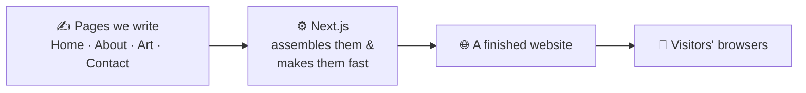
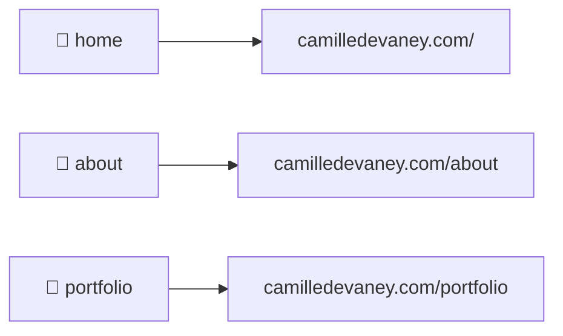
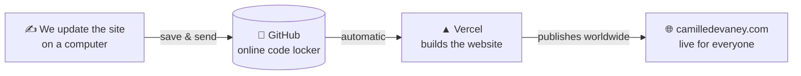

# camilledevaney.com

The personal website of **Camille Devaney** — a single home on the internet for her
**professional work** (the front door) and her **artwork**.

This README explains, in plain language, the two tools that make the site work:
**Next.js** (which builds the site) and **Vercel** (which publishes it to the world).
No prior tech knowledge needed. 👋

---

## 🧩 How Next.js works (the tool that *builds* the site)

A website is really just a set of **pages** — Home, About, Portfolio, Contact, and so
on. **Next.js is the workshop that turns those pages into a real, fast website.**



The one idea that explains most of it: **a folder is a web address.** We make a folder,
and Next.js turns it into a page people can visit.



So adding a new page (say, a gallery of paintings) is as simple as adding a new
folder — Next.js handles all the wiring behind the scenes. It also makes the site
**fast** and **easy for Google to find**, so people discover Camille's work.

---

## 🚀 How Vercel works (the service that *publishes* the site)

We never upload files by hand. Instead, a service called **Vercel** acts like an
**always-on automatic publisher**. The moment we save a change, Vercel rebuilds the
website and pushes it live to the whole world — usually in under a minute.



Step by step:

1. **We save our changes** and send them up to **GitHub** (think: an online locker that
   safely stores the site's files).
2. **Vercel is always watching that locker.** The instant new files arrive, it
   **automatically builds the website** (the same "assemble" step Next.js does).
3. **Vercel publishes the result everywhere**, and `camilledevaney.com` updates itself.

Vercel quietly handles the hard parts for us:

- 🔒 **The padlock / HTTPS** — visitors get a secure connection, set up automatically.
- 🌍 **Speed everywhere** — the site is copied to servers around the globe so it loads
  fast no matter where a visitor is.
- 👀 **Preview links** — before a change goes live, Vercel makes a private preview
  website so we can look at it first. Nothing reaches the real site until we approve it.

> 💡 Next.js and Vercel are made by **the same company**, which is why they fit together
> so smoothly: Next.js *builds* the site, and Vercel *publishes* it.

---

## 🖥️ Running it on your own computer

You only need this to preview changes before they go live. From the project folder:

```bash
npm install        # one time: download what the site needs
npm run dev        # start it, then open http://localhost:3000
```

The page auto-refreshes every time a file is saved. Press `Ctrl+C` to stop.

Prefer a one-command, self-contained setup? Use Docker:

```bash
docker compose up --build      # then open http://localhost:3000
```

More detail — the full project tour, the build commands, and the Docker files — lives
in **`CLAUDE.md`** in this same folder.

---

## 🛠️ What it's built with

| Piece | Tool | In one line |
|---|---|---|
| Builds the pages | **Next.js 16** | Turns our page files into the website |
| The look | **Tailwind CSS** | Colors, spacing, fonts, layout |
| Publishes it live | **Vercel** | Builds and serves the site to the world |
| Stores the code | **GitHub** | The online locker the code lives in |
